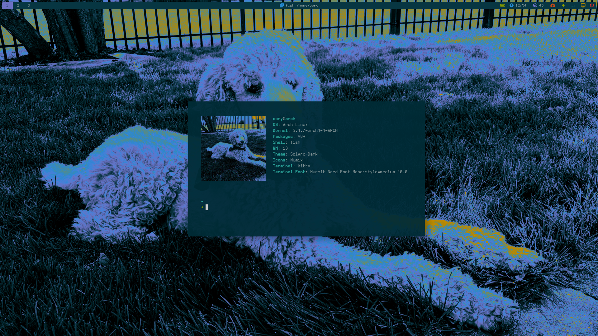

# Arch .dotfiles

#### Notes

- `~/.local/bin` needs to be added to `$PATH`
- install figlet fonts from [xero on github](https://github.com/xero/figlet-fonts)

#### Packages
- bc
- compton
- corrupter-git
- feh
- git
- google-chrome
- gtk-theme-solarc-git
- i3-gaps
- i3lock
- i3status
- imagemagick
- inkscape
- light-git
- lolcat
- lxappearance
- mirage
- neofetch
- nerd-fonts-complete-mono-glyphs
- network-manager-applet
- noto-fonts
- numix-icon-theme-git
- otf-hermit
- polybar-git
- python-pip
- ranger
- rofi
- rxvt-unicode-pixbuf
- scrot
- stow
- thinkfan
- toilet
- ttf-iosevka
- ttf-ms-fonts
- ttf-unifont
- undefined-medium-fonts
- volumeicon
- xclip
- xcursor-capitaine
- xgetres
- yay
