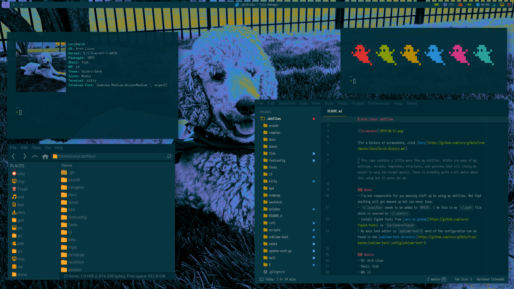

# Arch Linux .dotfiles

(For a history of screenshots, click [here](https://github.com/cory-g/dots/tree/master/docs/Scrot_History.md))

> This repo contains a little more than my dotfiles. Within are many of my settings, scripts, templates, structures, and opinions that will likely be useful to very few except myself. There is probably quite a bit amiss about this setup but it works for me.

### Notes
- I'm not responsible for you messing stuff up by using my dotfiles. Not that anything will get messed up but you never know.
- `~/.local/bin` needs to be added to `$PATH`. I do this in my `~/.path` file which is sourced by `~/.xinitrc`.
- install figlet fonts from [xero on github](https://github.com/xero/figlet-fonts) to `/usr/share/figlet`.
- My main text editor is `sublime-text-3` most of the configuration can be found in the [sublime-text directory](https://github.com/cory-g/dots/tree/master/sublime-text/.config/sublime-text-3)

### Basics
- OS: Arch Linux 
- Shell: fish 
- WM: i3 
- Theme: SolArc-Dark 
- Icons: Numix 
- Terminal: alacritty 

### Partition Scheme
| NAME | SIZE | MOUNTPOINT | FSTYPE |
|---|---|---|---|
| sda | 465.8G |   |   |
| sda1 | 512M | /boot | ext4 |
| sda2 | 12G | [SWAP] | swap |
| sda3 | 453.3G | / | btrfs |
| sdb | 477G |   |   |
| sdb1 | 477G | /home | btrfs |

### Packages
For a complete list of packages installed from the official repositories as well as the AUR, please click [here](https://github.com/cory-g/dots/tree/master/docs/Packages.md).

